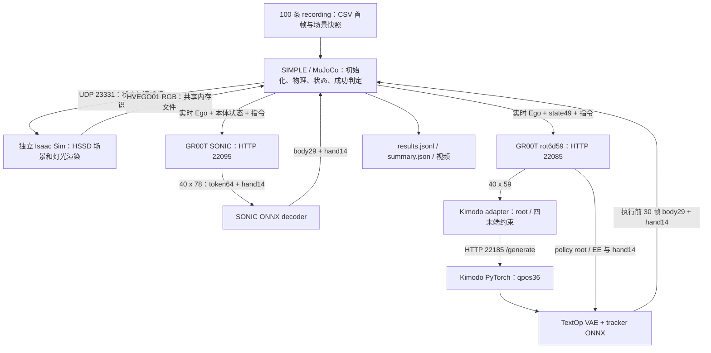

> Publication update: the current release is `icra2027`. See repository `ICRA2027.md` for actual repositories, pinned commits, exclusions and validation. Older upload plans below are historical.

# Task3 LQB：SONIC / Kimodo + TextOp 完整评测链路

核对日期：2026-09-06。范围是当前工作区以下两个文件中列出的实际命令及其下游实现：

- `scripts/deploy/eval_lqb_simple_task3_sonic.sh`
- `scripts/deploy/eval_lqb_simple_task3_textop.sh`

这两个文件是含 Markdown 代码围栏的**分终端命令备忘录**，不是可以整文件 `bash` 执行的脚本。应分别执行其中的 bash 代码块。本文按这些显式参数解析默认值；父 shell 中额外导出的环境变量仍可能改变行为。此次只整理文档、读取配置并执行 recording 静态预检，没有启动 GPU 服务或跑评测。

## 1. 整体结构与职责



两条路径是替代实验。MuJoCo 负责动力学、接触、机器人真实反馈状态和成功判定；Isaac 只镜像状态并提供同步视觉。这里不是实机 LowCmd 部署，也不是直接播放训练视频。

## 2. 当前参数对照

| 项目 | SONIC | Kimodo + TextOp |
|---|---|---|
| 终端数 | 3：GR00T、Isaac、eval | 4：GR00T、Kimodo、Isaac、eval |
| 任务 ID | `G1Fullstate20260804Task3-v0` | 同左 |
| 指令 | `Step on the pedal to open the trash can in front of you.` | 同左 |
| GR00T checkpoint | `ckpt/gr00tn17/task3_isaac_sonic_lqb/checkpoint-60000` | `ckpt/gr00tn17/task3_isaac_overlap12_gt-ki-tp_lqb/checkpoint-60000` |
| GR00T 端口 | 22095 | 22085 |
| 预测 / 实际执行帧数 | 40 / 40 | 40 / 30 |
| Prefix-RTC | 关闭 | 开启，`groot_clean`，保留上一块 `[30:40]` 10 帧 |
| action 表示 | 78D = motion token64 + hand14 | 59D = hand14 + root9 + 四个 EE9 |
| 本体输入 | 46D，重排关节与 projected gravity | 49D = hand14 + body29 + root6 |
| 下层控制 | SONIC release decoder ONNX | Kimodo student → TextOp one-step tracker |
| Kimodo | 不启动 | PyTorch、original 文本编码器、policy_only、20 diffusion steps、keyframe step 10 |
| 初始化 | recording 首帧，seed 42，未固定 index | 同左 |
| 评测量 | episode 0 起，共 100，最多 500 steps/episode | 同左 |
| 视频 / GPU | 保存视频；命令指定 GPU 0 | 同左 |
| 仿真模式 | `mujoco_external_isaac` | 同左 |

表内相对 `ckpt/` 路径均以 `/home/ubuntu/yzh` 为根。两份 checkpoint 的 `config.json` 已核对：SONIC `action_horizon=40, train_prefix_rtc=false, train_rtc=false`；TextOp `action_horizon=40, train_prefix_rtc=true, train_rtc=true, train_rtc_max_delay=12, prefix_rtc_timestep_mode=groot_clean`。训练目录名称 overlap12 不代表本次运行重叠 12 帧；运行重叠由 40−30=10 决定。

## 3. 仓库与运行环境

以下 HEAD 仅用于定位；本地未提交修改也属于当前链路，迁移时不能只按 HEAD 克隆后假定一致。

| 路径 | 当前 HEAD | 职责 |
|---|---|---|
| `/home/ubuntu/yzh/Psi0_kimodo_textop` | `f01a699` | 调度、GR00T HTTP 服务、Kimodo HTTP 服务 |
| `/home/ubuntu/yzh/Psi0_kimodo_textop/third_party/SIMPLE` | `ee9a181` | 评测循环、任务、控制适配、MuJoCo / Isaac 通信 |
| `/home/ubuntu/yzh/Isaac-GR00T-rtc` | `b581c6d` | GR00T N1.7 模型实现、processor、modality 和 Cosmos backbone |
| `/home/ubuntu/yzh/kimodo_my` | `18b2f12` | Kimodo student 构建、约束生成、动作表示与 qpos 导出 |
| `/home/ubuntu/yzh/HumanoidVLA_MJ_backup/HumanoidVLA_MJ` | `afb35c10` | 独立 Isaac viewer、任务 MJCF / mesh、离线数据生成 |
| `/home/ubuntu/yzh/GR00T-WholeBodyControl` | `57f8285` | 此命令直接引用 SONIC release decoder 权重 |
| `/home/ubuntu/yzh/Psi0_kimodo_textop/third_party/SIMPLE/third_party/gear_sonic` | 本地无独立 .git；见迁移审计中的 pinned commit | SIMPLE 实际安装的 gear_sonic 控制/机器人依赖 |
| `/home/ubuntu/yzh/Psi0_kimodo_textop/third_party/SIMPLE/third_party/decoupled_wbc` | 本地无独立 .git；见迁移审计中的 pinned commit | SIMPLE 实际安装的 decoupled_wbc 依赖 |

SIMPLE 的安装元数据 `direct_url.json` 确認 `gear_sonic`、`decoupled_wbc` 来自其内部 `third_party/`。不能因为 decoder 放在 `GR00T-WholeBodyControl`，就把实际 Python 控制代码也归到该仓库。

| 进程 | 解释器 / 环境 |
|---|---|
| 两种 GR00T 服务 | `/home/ubuntu/yzh/Isaac-GR00T-rtc/.venv/bin/python` |
| SIMPLE eval 和 recording 预检 | `/home/ubuntu/yzh/Psi0_kimodo_textop/third_party/SIMPLE/.venv/bin/python` |
| Kimodo 服务 | `/home/ubuntu/miniconda3/envs/kimodo/bin/python` |
| Isaac renderer | `/home/ubuntu/isaacsim/python.sh` |

还需各环境内的 PyTorch、Transformers、ONNX Runtime CUDA、MuJoCo、SIMPLE 的 SDK/控制依赖和 Isaac Sim 安装。脚本会处理 ORT CUDA 动态库路径；TextOp eval 先创建 VAE/policy ONNX session 检查 CUDA provider。通用 TextOp/Isaac wrapper 默认 CPU affinity 为 `16-31`，可分别用 `*_CPUSET` 覆盖。GPU 编号是各进程 `CUDA_VISIBLE_DEVICES` 的选择，当前备忘录全部指定 0。

## 4. 实际脚本调用关系

### 4.1 SONIC

```text
eval_lqb_simple_task3_sonic.sh（命令备忘录）
  终端 1 → fullstate_task1_gr00t_n17_sonic_eval.sh serve
             → Isaac-GR00T-rtc/.venv/bin/python
             → Psi0/scripts/deploy/gr00t_n17_sonic_server.py
             → gr00t.policy.gr00t_policy.Gr00tPolicy
  终端 2 → fullstate_task3_gr00t_rot6d59_kimodo_textop_eval.sh isaac
             → fullstate_task1_gr00t_rot6d59_kimodo_textop_eval.sh isaac
             → validate_fullstate_recordings.py
             → HumanoidVLA_MJ/scripts/deploy/task3_isaac_hssd_viewer.py
  终端 3 → fullstate_task1_gr00t_n17_sonic_eval.sh eval
             → SIMPLE/src/simple/cli/eval_decoupled_wbc.py
             → baseline gr00t_n17_sonic
             → SONIC decoder ONNX → ActionCmd → MuJoCo
```

虽然 wrapper 名称带 task1，任务由 `GR00T_SONIC_TASK` 和 `TASK3_*` 显式选择。当前 SONIC 备忘录**没有**调用 `fullstate_task3_gr00t_n17_sonic_eval.sh`。原生 SONIC eval 的 wrapper 也不运行通用 TextOp wrapper 的 preflight，但任务 reset 仍检查 recording。

### 4.2 TextOp

```text
eval_lqb_simple_task3_textop.sh（命令备忘录）
  所有终端 → fullstate_task3_gr00t_rot6d59_kimodo_textop_eval.sh
             → 设置 TASK_NUMBER=3、任务 ID 等
             → fullstate_task1_gr00t_rot6d59_kimodo_textop_eval.sh
             → validate_fullstate_recordings.py
  serve       → gr00t_n17_rot6d59_server.py
                 → examples/unitree_g1_rot6d59_config.py
                 → Gr00tPolicy + gr00t_n17_prefix_rtc.py
  kimodo-serve → simple_psi0_kimodo_eval_commands.sh kimodo-serve
                 → kimodo_generation_server.py
                 → kimodo_my/scripts/generate_g1_with_first_heading.py
  isaac       → task3_isaac_hssd_viewer.py
  eval        → 检查 Kimodo /config、处理 RESUME、设置外部 Isaac 参数
                 → simple_psi0_kimodo_eval_commands.sh eval-rot6d59-textop-onestep
                 → configure_textop_onestep_defaults
                 → SIMPLE/src/simple/cli/eval_decoupled_wbc.py
                 → psi0_kimodo_textop_tracker
                 → kimodo_adapter + textop_tracker_adapter → MuJoCo
```

TextOp 接收完整 40 帧参考，执行前 30 帧后再阻塞请求。GR00T 的 10 帧 prefix 与 `KIMODO_RTC_PREFIX_FRAMES=0` 是不同层的开关：本次没有单独继承 Kimodo qpos 尾段，Kimodo 仍生成整块。`TEXTOP_POLICY_ROOT_EE=1` 让 tracker 的 root/EE 参考来自 VLA；身体参考来自 Kimodo；手部来自 VLA hand14。`VLA_PROPRIO_SOURCE=actual` 使用实际反馈。

`KIMODO_POLICY_ONLY_INITIAL_QPOS=1` 与 adapter 的初始块处理关联，用 reset qpos 对齐初始参考；不代表每个未来目标都来自真实状态。59D 的 rot6d 使用 `cols_rowmajor`（`R[:, :2].reshape(-1)`）转到内部 44D 欧拉表达，再组装 root xyz/yaw + 四末端位姿 28D 约束，进行 MuJoCo z-up / Kimodo y-up 转换。Kimodo 输出 qpos36 = root xyz3 + quaternion4 + body29；TextOp one-step 模式 `TEXTOP_FUTURE_STEPS=1`，VAE window 为 10。

### 4.3 需要保留的关键源码清单

下面列出实际主链及其主要内部模块；迁移应保留完整仓库/包和资源目录，而不是仅拷贝这些入口文件。

| 文件绝对路径 | 作用 | 当前存在 |
|---|---|---|
| `/home/ubuntu/yzh/Psi0_kimodo_textop/scripts/deploy/fullstate_task1_gr00t_n17_sonic_eval.sh` | SONIC serve/eval 调度 | 是 |
| `/home/ubuntu/yzh/Psi0_kimodo_textop/scripts/deploy/fullstate_task3_gr00t_rot6d59_kimodo_textop_eval.sh` | Task3 wrapper | 是 |
| `/home/ubuntu/yzh/Psi0_kimodo_textop/scripts/deploy/fullstate_task1_gr00t_rot6d59_kimodo_textop_eval.sh` | 通用四终端调度、预检、Isaac 参数、续跑 | 是 |
| `/home/ubuntu/yzh/Psi0_kimodo_textop/scripts/deploy/simple_psi0_kimodo_eval_commands.sh` | Kimodo 服务与 TextOp one-step 默认值 | 是 |
| `/home/ubuntu/yzh/Psi0_kimodo_textop/scripts/deploy/gr00t_n17_sonic_server.py` | SONIC 46D 输入 / 78D 输出 | 是 |
| `/home/ubuntu/yzh/Psi0_kimodo_textop/scripts/deploy/gr00t_n17_rot6d59_server.py` | rot6d59 服务 | 是 |
| `/home/ubuntu/yzh/Psi0_kimodo_textop/scripts/deploy/gr00t_n17_prefix_rtc.py` | Prefix-RTC | 是 |
| `/home/ubuntu/yzh/Psi0_kimodo_textop/scripts/deploy/kimodo_generation_server.py` | 常驻 Kimodo HTTP 服务 | 是 |
| `/home/ubuntu/yzh/Psi0_kimodo_textop/third_party/SIMPLE/scripts/validate_fullstate_recordings.py` | recording 预检 | 是 |
| `/home/ubuntu/yzh/Psi0_kimodo_textop/third_party/SIMPLE/src/simple/cli/eval_decoupled_wbc.py` | episode 循环、结果、视频 | 是 |
| `/home/ubuntu/yzh/Psi0_kimodo_textop/third_party/SIMPLE/src/simple/tasks/g1_fullstate_20260804_task3.py` | Task3 reset 与成功规则 | 是 |
| `/home/ubuntu/yzh/Psi0_kimodo_textop/third_party/SIMPLE/src/simple/tasks/g1_fullstate_20260615_task1.py` | 继承的任务公共配置 | 是 |
| `/home/ubuntu/yzh/Psi0_kimodo_textop/third_party/SIMPLE/src/simple/tasks/g1_fullstate_recordings.py` | CSV 首帧、随机顺序、快照哈希 | 是 |
| `/home/ubuntu/yzh/Psi0_kimodo_textop/third_party/SIMPLE/src/simple/baselines/gr00t_n17_sonic.py` | token 解码、手部顺序、执行队列 | 是 |
| `/home/ubuntu/yzh/Psi0_kimodo_textop/third_party/SIMPLE/src/simple/baselines/psi0_kimodo_textop_tracker.py` | 59D 转换和 tracker 控制 | 是 |
| `/home/ubuntu/yzh/Psi0_kimodo_textop/third_party/SIMPLE/src/simple/baselines/psi0_kimodo_decoupled_wbc.py` | state49、HTTP policy 基类 | 是 |
| `/home/ubuntu/yzh/Psi0_kimodo_textop/third_party/SIMPLE/src/simple/baselines/kimodo_adapter.py` | 约束、Kimodo HTTP 调用、qpos 重采样 | 是 |
| `/home/ubuntu/yzh/Psi0_kimodo_textop/third_party/SIMPLE/src/simple/baselines/textop_tracker_adapter.py` | VAE/ONNX、状态归一化和关节映射 | 是 |
| `/home/ubuntu/yzh/Psi0_kimodo_textop/third_party/SIMPLE/src/simple/baselines/client.py` | HTTP action client | 是 |
| `/home/ubuntu/yzh/Psi0_kimodo_textop/third_party/SIMPLE/src/simple/envs/base_dual_env.py` | mujoco_external_isaac 选择 | 是 |
| `/home/ubuntu/yzh/Psi0_kimodo_textop/third_party/SIMPLE/src/simple/envs/sonic_loco_manip.py` | 仿真环境 | 是 |
| `/home/ubuntu/yzh/Psi0_kimodo_textop/third_party/SIMPLE/src/simple/engines/mujoco.py` | MuJoCo 场景和物理 | 是 |
| `/home/ubuntu/yzh/Psi0_kimodo_textop/third_party/SIMPLE/src/simple/engines/external_isaac_ego.py` | UDP 状态与 HVEGO01 同步 | 是 |
| `/home/ubuntu/yzh/Psi0_kimodo_textop/third_party/SIMPLE/src/simple/robots/g1_sonic.py` | G1 MJCF 与底层控制 | 是 |
| `/home/ubuntu/yzh/Psi0_kimodo_textop/third_party/SIMPLE/src/simple/agents/sonic_decoupled_wbc_agent.py` | 共享控制依赖 | 是 |
| `/home/ubuntu/yzh/Isaac-GR00T-rtc/gr00t/policy/gr00t_policy.py` | GR00T 模型加载和推理 | 是 |
| `/home/ubuntu/yzh/Isaac-GR00T-rtc/examples/unitree_g1_rot6d59_config.py` | TextOp modality | 是 |
| `/home/ubuntu/yzh/kimodo_my/scripts/generate_g1_with_first_heading.py` | distill student / text encoder 构建 | 是 |
| `/home/ubuntu/yzh/kimodo_my/kimodo/exports/mujoco.py` | Kimodo 到 MuJoCo qpos | 是 |
| `/home/ubuntu/yzh/HumanoidVLA_MJ_backup/HumanoidVLA_MJ/scripts/deploy/task3_isaac_hssd_viewer.py` | Isaac 状态镜像、USD/mesh、相机、灯光 | 是 |

## 5. 权重、配置、模型缓存

| 路径 | 用途 | 当前存在 |
|---|---|---|
| `/home/ubuntu/yzh/ckpt/gr00tn17/task3_isaac_sonic_lqb/checkpoint-60000` | SONIC GR00T 完整 checkpoint | 是 |
| `/home/ubuntu/yzh/ckpt/gr00tn17/task3_isaac_overlap12_gt-ki-tp_lqb/checkpoint-60000` | TextOp GR00T 完整 checkpoint | 是 |
| `/home/ubuntu/yzh/Isaac-GR00T-rtc/huggingface/Cosmos-Reason2-2B` | 两条 GR00T 的离线 backbone/tokenizer/配置 | 是 |
| `/home/ubuntu/yzh/GR00T-WholeBodyControl/gear_sonic_deploy/policy/release/model_decoder.onnx` | SONIC 在线 decoder | 是 |
| `/home/ubuntu/yzh/ckpt/kimodo/g1_distill_16to8_100to20_dagger_teacher_gt03_100k_bs4x4_k3_cosine_selfacc50_rootacc10_headingacc10_gtbranch/resolved_config.yaml` | Kimodo student 配置 | 是 |
| `/home/ubuntu/yzh/ckpt/kimodo/g1_distill_16to8_100to20_dagger_teacher_gt03_100k_bs4x4_k3_cosine_selfacc50_rootacc10_headingacc10_gtbranch/ema_final.pt` | Kimodo student 参数 | 是 |
| `/home/ubuntu/yzh/ckpt/textop/2026-06-11_11-39-47_rgz_loco_manip_obj_transf_vae_1step_ddp_4gpu_gear_sonic_ads_naug/latest.onnx` | TextOp one-step tracker | 是 |
| `/home/ubuntu/yzh/ckpt/vae/2026-05-30_04-21-30_npz_rgz_filtered_ddp_save/artifacts/motion_transformer_vae_encoder_z_c.onnx` | TextOp motion VAE encoder | 是 |
| `/home/ubuntu/yzh/ckpt/vae/2026-05-30_04-21-30_npz_rgz_filtered_ddp_save/artifacts/stats.npz` | TextOp VAE 归一化 | 是 |
| `/home/ubuntu/yzh/kimodo_my/huggingface/hub/models--nvidia--Kimodo-G1-RP-v1/snapshots/3020ad8c419c244e0429d360163730c63c4ed011/stats/motion` | Kimodo student motion stats | 是 |
| `/home/ubuntu/yzh/kimodo_my/huggingface/hub/models--McGill-NLP--LLM2Vec-Meta-Llama-3-8B-Instruct-mntp/snapshots/31474e395ada192e8ed1586db6be79fb3b70c9c0` | original 文本编码器 base | 是 |
| `/home/ubuntu/yzh/kimodo_my/huggingface/hub/models--McGill-NLP--LLM2Vec-Meta-Llama-3-8B-Instruct-mntp-supervised/snapshots/baa8ebf04a1c2500e61288e7dad65e8ae42601a7` | original 文本编码器 PEFT | 是 |

GR00T checkpoint 包含两个 `model-*.safetensors` 分片及 `model.safetensors.index.json`、`config.json`、`processor_config.json`、`statistics.json`、`embodiment_id.json`、`experiment_cfg/`。整理/迁移优先保留完整 checkpoint，不能只带一个权重分片。optimizer/RNG 等属于训练续训产物，不是在线推理核心。

Kimodo 的相对缓存路径按工作目录 `/home/ubuntu/yzh/kimodo_my` 解析。当前 `_build_model_from_distill` 实例化 `student_denoiser` 和 `text_encoder`，随后加载 `ema_final.pt`；YAML 中 teacher 的 `model.safetensors` 不能仅因出现在配置里就算作本次 student 路径实际加载的权重。搬运 Hugging Face cache 要包括 symlink 指向的 blobs。当前 `KIMODO_USE_TRT=0`，不需要 wrapper 中默认的 T24 TensorRT engine。SONIC `model_encoder.onnx` 属于训练数据 token 重编码环节，本次在线控制直接加载的是 decoder。

### 5.1 仍会初始化的共享 WBC 权重

两条 baseline 的构造链都会创建 `SonicDecoupledWbcAgent`，再调用 `decoupled_wbc/control/policy/wbc_policy_factory.py`。即使本次 `SKIP_STABILIZE=1`，构造期间仍会加载以下 Balance/Walk ONNX，不能从依赖包中删除：

- `/home/ubuntu/yzh/Psi0_kimodo_textop/third_party/SIMPLE/third_party/decoupled_wbc/sim2mujoco/resources/robots/g1/policy/GR00T-WholeBodyControl-Balance.onnx`
- `/home/ubuntu/yzh/Psi0_kimodo_textop/third_party/SIMPLE/third_party/decoupled_wbc/sim2mujoco/resources/robots/g1/policy/GR00T-WholeBodyControl-Walk.onnx`

两文件本次均确认存在。主策略接管后的控制仍分别为 SONIC decoder 和 TextOp tracker。这些初始化依赖不意味着 TextOp 的主循环改用 SONIC token。还需保留两个内嵌控制包的 `data/robot_model/`、`control/robot_model/`、`sim2mujoco/` 配置与资源。SIMPLE 通过 `gear_sonic/utils/mujoco_sim/configs.py` 读取 `gear_sonic/utils/mujoco_sim/wbc_configs/g1_29dof_sonic_model12.yaml`；共享 WBC 通过 `decoupled_wbc/control/main/teleop/configs/configs.py` 读取自己的配置。

## 6. 数据、场景与资产

### 6.1 在线评测直接读取的 recording

根目录：`/home/ubuntu/yzh/mujoco_recordings/20260804_task3_lqb`。

当前有 **100** 个 `*/data.csv`。每条至少需要：

```text
<recording>/data.csv
<recording>/model_snapshot/mujoco/model/g1/scene_43dof.xml
<recording>/model_snapshot/ 下被 XML include / mesh / texture 引用的资源
```

公共 loader 从 CSV 第一行解析连续 `qpos0..qpos51`，检查维数、语义字段、有限值、根四元数和场景 XML 一致性。qpos 前 50 维是浮动根7 + body29 + hand14，50/51 分别为垃圾桶 lid/pedal。

每个 episode 以 recording 首帧 reset，随后由策略闭环驱动，不逐帧跟随录制 CSV。未指定 index 时对按目录名排序的池执行 `default_rng(seed + cycle).permutation(pool_size)`；本次 seed=42。固定 `TASK3_RECORDING_INDEX=0` 是固定排序后第 0 条，并非随机序列第 0 条。跨池循环时 seed 增加。

本次已实际执行预检并通过：

```text
[recording-preflight] task=3 recordings=100 nq=52
scene_sha256=7c9d7bd3c2874371094054975138da0f69b25b14ee453200d67080d4a4725f6c
```

预检不等价于全量 mesh 编译和 GPU 渲染验证。

### 6.2 MuJoCo 物理资产与 Isaac 视觉资产

- SIMPLE 机器人主模型：`/home/ubuntu/yzh/Psi0_kimodo_textop/third_party/SIMPLE/data/robots/g1_sonic/g1_29dof_with_hand.xml` 及引用资源。
- Task3 垃圾桶物理资产：`/home/ubuntu/yzh/HumanoidVLA_MJ_backup/HumanoidVLA_MJ/mujoco/model/task_assets/2real_asset/trash/step_trash_can.xml` 及其 meshes。Task3 定义的放置为 pos `[0.78,0,0]`、quat `[0.707107,0,0,-0.707107]`、scale `0.395257`。
- Isaac 主场景：`/home/ubuntu/yzh/Psi0_kimodo_textop/third_party/SIMPLE/data/scenes/hssd/102344250/102344250_local.usd` 及其递归 USD references、textures/materials。仅复制 USD 文件不足以搬迁。
- Isaac 以排序后的首条 recording 快照启动；随后由 external client 发送当前 recording 的状态与身份，做机器人/物体映射和灯光一致性检查。

两条备忘录的视觉参数一致：任务平移 `0.6 -0.5 0`，ego eye `0.10 0.06 0.70`，forward `0.71735609 0 -0.69670671`，up `0.69670649 0.00079633 0.71735586`，ego 与主画面均 1280×720，headless=1，scripted lighting，机器人颜色 sRGB→linear，圆柱平滑开启，robot/trash/free-object z offset 分别 0.012/0.006/0。wrapper 默认 FOVY=70、near clip=0.2。任务渲染平移不能直接等同于修改 MuJoCo 内垃圾桶位置。

### 6.3 灯光清单与关联 LeRobot 数据

共同父目录：`/home/ubuntu/yzh/HumanoidVLA_MJ_backup/HumanoidVLA_MJ/output/task3_lqb_isaac_lerobot/scene3`。

| 分支 | 目录 | 在线直接使用 |
|---|---|---|
| TextOp | `task3_lqb_all` | `meta/lighting.jsonl` |
| SONIC | `task3_lqb_all_groot_sonic_release_train` | `meta/lighting.jsonl` |

两份 `meta/info.json` 当前均记录 100 episodes、21,136 frames、50 FPS；`meta/tasks.jsonl` 是相同踩踏板开垃圾桶指令。SONIC 目录还有 `meta/sonic_release_reencode.json`。在线配置虽设 `ISAAC_RANDOMIZE_LIGHTING=0`，仍显式传入 lighting manifest，viewer 会按 recording index/name 应用对应灯光；这不等于所有 episode 使用同一盏灯。

当前 `DATA_FORMAT=fixed DATA_DIR=unused`；不通过 LeRobot loader 把上述目录的 MP4/Parquet 当在线观测源。要复现实验只需其直接依赖的灯光清单；要保留数据加工/训练来源，则应保存完整数据目录及转换报告。

checkpoint 保存的训练路径分别是：

- SONIC：`/pfs/pfs-oHNwH0/mnt/pfs/humanoid/yzh/Psi0/data/output/lqb_fullstate_20260804_task3_gr00t_new`
- TextOp：`/pfs/pfs-oHNwH0/mnt/pfs/humanoid/yzh/Psi0/data/output/lqb_fullstate_20260804_task3_rot6d59`

这些是训练时路径记录，并不是当前 eval 需要挂载的在线输入。仅凭目录名和这次元数据读取，不能声称本机关联目录与训练路径逐文件一致。离线回放/渲染入口可从 `HumanoidVLA_MJ/scripts/deploy/replay_get_isaccsim_task3_lqb.sh` 追到 `render_task3_replay_isaac_lerobot.sh`、`render_task3_replays_isaac_lerobot.sh`；它们是生成数据的上游工具，不是本次在线评测自动执行的步骤。

## 7. 通信与启动检查

| 接口 | 用途 |
|---|---|
| HTTP `127.0.0.1:22095` | SONIC GR00T `/act`、`/config` |
| HTTP `127.0.0.1:22085` | rot6d59 GR00T `/act`、`/health`、`/config` |
| HTTP `127.0.0.1:22185` | Kimodo `/generate`、`/config` |
| UDP `127.0.0.1:23331` | MuJoCo 状态发往 Isaac |
| `/dev/shm/simple_task3_isaac_ego.frame` | Isaac 发布 HVEGO01 图像；SIMPLE 同步读取 |

Isaac wrapper 配置 live ego 50 Hz、strict request sync 和 render throttle。共享内存不是输入视频路径，而是当前状态对应的 RGB 帧传输文件。Kimodo 请求含 `constraints`、`heading_source_npz`、`output` 等**本机文件路径**，所以 eval 和 Kimodo 服务还共享工作目录文件系统，不能只把 HTTP 服务搬到另一台机器就假设可用。

按照原备忘录分终端启动；服务初始化完成且 Isaac 显示等待 MuJoCo 状态 / live ego 路径后启动 eval。可检查：

```bash
curl -fsS --max-time 3 http://127.0.0.1:22095/config  # SONIC
curl -fsS --max-time 3 http://127.0.0.1:22085/config  # TextOp GR00T
curl -fsS --max-time 3 http://127.0.0.1:22185/config  # Kimodo
```

监听端口、health 成功和共享内存文件存在都不单独证明闭环就绪，还要看模型路径、配置匹配、当前 session 的帧同步及实际 episode 推进。两个方案复用 UDP 23331 和同一 frame 文件，应分别运行；要同时跑需隔离端口、frame 文件、GPU/进程资源。

## 8. 成功规则、输出与续跑

Task3 成功判定读取 MuJoCo 命名 joint `custom_step_trash_can_lid_hinge_joint`：盖子角度 `>=0.8 rad` 连续 **10 次 reward 计算**后 latch success。可由 `TASK3_LID_THRESHOLD_RAD`、`TASK3_SUCCESS_HOLD_STEPS` 覆盖。任务规则本身不直接判断脚接触或接近距离；评测循环另外会把跌倒停止和运行异常计为失败。不能把这里的 10 次直接解释为 10 个 MuJoCo 积分 substeps。

当前 `MAX_EPISODE_STEPS=500` 覆盖 Task3 类/wrapper 中较大的默认值。`results.jsonl` 每条包括 task、episode、recording/index、seed、scene_sha256、success、reason、steps、elapsed_seconds、metrics（lid 角度/保持步数/阈值）。失败原因区分 timeout、fall、policy_or_isaac_error 等。

| 产物 | 当前默认位置 |
|---|---|
| SONIC 结果/视频 | `/home/ubuntu/yzh/Psi0_kimodo_textop/third_party/SIMPLE/data/evals_task3_lqb_isaac_lqb_sonic_run001_ckpt60k_eps100` |
| SONIC action debug | 上述目录 `/debug` |
| TextOp 结果/视频 | `/home/ubuntu/yzh/Psi0_kimodo_textop/third_party/SIMPLE/data/evals_task3_lqb_isaac_lqb_run001_ckpt60k_eps100` |
| TextOp Kimodo 工作目录 | `/home/ubuntu/yzh/Psi0_kimodo_textop/outputs/kimodo_task3_lqb_isaac_lqb_run001_ckpt60k_eps100` |
| Isaac 输出目录 | `/home/ubuntu/yzh/HumanoidVLA_MJ_backup/HumanoidVLA_MJ/output/task3_lqb_isaac_hssd_scene3` |

评测目录包含 `results.jsonl`、`summary.json`、`eval_stats.txt` 和启用的视频。Kimodo chunk 中间文件如 `constraints.json`、`heading_source.npz`、`g1_generated*` 默认临时清理（`KIMODO_KEEP_WORK=0`），设为 1 才保留。Isaac 输出目录并不是 recording 或训练图像输入。

SONIC 手动续跑：保持 RUN_TAG，设置下一 episode 的 `EPISODE_START`，`NUM_EPISODES` 填剩余数量。TextOp：保持 RUN_TAG，设 `RESUME=1`；wrapper 按已有 `results.jsonl` 中 `max(episode)+1` 续接，`NUM_EPISODES=100` 表示计划总数。它不补中间缺号，因此存在缺号/重复/换配置的结果文件应先审查，不能直接混入新实验。

## 9. 当前需要注意的注释与默认值差异

1. **SONIC readiness 注释过时**：原文要求 40/34、prefix_rtc=true，与显式 `GR00T_PREFIX_RTC=0` 不一致。更细地说，SONIC wrapper 仅在 prefix 开启时给 server 传 `--action-exec-horizon`，因此本次 `/config` 可能仍显示 server 默认 `execution_horizon=34, overlap_steps=6`；真正 eval 队列读取 `GR00T_EXECUTION_HORIZON=40`，无 prefix 时执行 40 帧。正确判断应同时看 prefix=false、预测40、eval 环境40，不能只凭 server 那个字段判定实际执行34。
2. 备忘录显式选择 `20260804_task3_lqb` 和 checkpoint-60000；直接裸运行 Task3 wrapper 仍可能落到 `20260804_task3_new`、`task3_newbg` 等旧默认。应保留完整命令环境变量。
3. TextOp 通用 wrapper 默认 `KIMODO_USE_TRT=1`，但当前备忘录的 Kimodo 和 eval 块都显式设0；复现 PyTorch 路径不可漏掉这两个覆盖。
4. TextOp 使用 one-step 覆盖后的 `ckpt/textop` 和 `ckpt/vae` 文件，不是通用脚本前部旧 `/pfs/.../textop` 默认权重。
5. 本文记录的是源码和磁盘配置快照，未重新验证正在运行的 PID、GPU session、全部 mesh/USD 递归依赖或 100 集成功率。已通过的 recording 预检只代表其检查范围。

## 10. 原始启动命令快照

以下为本次读取的两个备忘录内容，保留原参数便于复核。上面的差异说明优先用于解释已过时注释；未修改源文件。

### eval_lqb_simple_task3_sonic.sh

源文件：`/home/ubuntu/yzh/Psi0_kimodo_textop/scripts/deploy/eval_lqb_simple_task3_sonic.sh`

SHA256：`fc63be5815c4bc2f95d60879a0ae1d9e3b00e46cc9b060b2a1dfdc45a6ffbed6`

````markdown
# ----------------------- Terminal 1: GR00T SONIC -----------------------

```bash
cd /home/ubuntu/yzh/Psi0_kimodo_textop

PSI0_ROOT=/home/ubuntu/yzh/Psi0_kimodo_textop \
SIMPLE_ROOT=/home/ubuntu/yzh/Psi0_kimodo_textop/third_party/SIMPLE \
GR00T_ROOT=/home/ubuntu/yzh/Isaac-GR00T-rtc \
GR00T_MODEL_PATH=/home/ubuntu/yzh/ckpt/gr00tn17/task3_isaac_sonic_lqb/checkpoint-60000 \
GR00T_BACKBONE_PATH=/home/ubuntu/yzh/Isaac-GR00T-rtc/huggingface/Cosmos-Reason2-2B \
GR00T_PREFIX_RTC=0 \
GR00T_EXECUTION_HORIZON=40 \
GR00T_PORT=22095 \
SERVE_GPU=0 \
bash scripts/deploy/fullstate_task1_gr00t_n17_sonic_eval.sh serve
```

# Readiness (must show prediction_horizon=40, execution_horizon=34,
# prefix_rtc=true, and prefix_rtc_timestep_mode=groot_clean):
#   curl -fsS http://127.0.0.1:22095/config


# ------------------------- Terminal 2: Isaac Ego -------------------------
```bash
cd /home/ubuntu/yzh/Psi0_kimodo_textop

TASK_RECORDINGS_DIR=/home/ubuntu/yzh/mujoco_recordings/20260804_task3_lqb \
TASK_HSSD_USD=/home/ubuntu/yzh/Psi0_kimodo_textop/third_party/SIMPLE/data/scenes/hssd/102344250/102344250_local.usd \
ISAAC_HEADLESS=1 \
ISAAC_UDP_PORT=23331 \
ISAAC_EGO_FRAME_PATH=/dev/shm/simple_task3_isaac_ego.frame \
ISAAC_LIGHT_RIG=scripted \
ISAAC_RANDOMIZE_LIGHTING=0 \
ISAAC_TRAINING_LIGHTING_MANIFEST=/home/ubuntu/yzh/HumanoidVLA_MJ_backup/HumanoidVLA_MJ/output/task3_lqb_isaac_lerobot/scene3/task3_lqb_all_groot_sonic_release_train/meta/lighting.jsonl \
TASK_EGO_EYE="0.10 0.06 0.70" \
TASK_EGO_FORWARD="0.71735609 0.0 -0.69670671" \
TASK_EGO_UP="0.69670649 0.00079633 0.71735586" \
TASK_TRANSLATE="0.6 -0.5 0.0" \
ISAAC_LIVE_EGO_WIDTH=1280 \
ISAAC_LIVE_EGO_HEIGHT=720 \
ISAAC_ROBOT_COLORS_SRGB_TO_LINEAR=1 \
ISAAC_SMOOTH_TASK_TABLE_CYLINDER=1 \
ISAAC_MAIN_WIDTH=1280 \
ISAAC_MAIN_HEIGHT=720 \
ISAAC_ROBOT_Z_OFFSET=0.012 \
ISAAC_TRASH_Z_OFFSET=0.006 \
ISAAC_FREE_OBJECT_Z_OFFSET=0.0 \
ISAAC_OUTPUT_DIR=/home/ubuntu/yzh/HumanoidVLA_MJ_backup/HumanoidVLA_MJ/output/task3_lqb_isaac_hssd_scene3 \
bash scripts/deploy/fullstate_task3_gr00t_rot6d59_kimodo_textop_eval.sh isaac
```

# 如需世界相机和右上角 Ego 小窗，将 ISAAC_HEADLESS 改成 0。


# ------------------------- Terminal 3: SONIC eval -------------------------
```bash
cd /home/ubuntu/yzh/Psi0_kimodo_textop

RUN_TAG=lqb_sonic_run001_ckpt60k_eps100

PSI0_ROOT=/home/ubuntu/yzh/Psi0_kimodo_textop \
SIMPLE_ROOT=/home/ubuntu/yzh/Psi0_kimodo_textop/third_party/SIMPLE \
GR00T_ROOT=/home/ubuntu/yzh/Isaac-GR00T-rtc \
HUMANOID_VLA_MJ_ROOT=/home/ubuntu/yzh/HumanoidVLA_MJ_backup/HumanoidVLA_MJ \
GR00T_MODEL_PATH=/home/ubuntu/yzh/ckpt/gr00tn17/task3_isaac_sonic_lqb/checkpoint-60000 \
GR00T_BACKBONE_PATH=/home/ubuntu/yzh/Isaac-GR00T-rtc/huggingface/Cosmos-Reason2-2B \
SONIC_DECODER_ONNX=/home/ubuntu/yzh/GR00T-WholeBodyControl/gear_sonic_deploy/policy/release/model_decoder.onnx \
GR00T_PREFIX_RTC=0 \
GR00T_EXECUTION_HORIZON=40 \
GR00T_PORT=22095 \
GR00T_SONIC_TASK=G1Fullstate20260804Task3-v0 \
GR00T_SONIC_EVAL_DIR="/home/ubuntu/yzh/Psi0_kimodo_textop/third_party/SIMPLE/data/evals_task3_lqb_isaac_${RUN_TAG}" \
TASK3_RECORDINGS_DIR=/home/ubuntu/yzh/mujoco_recordings/20260804_task3_lqb \
TASK3_RECORDING_INDEX= \
TASK3_RECORDING_SEED=42 \
SIM_MODE=mujoco_external_isaac \
EXTERNAL_ISAAC_UDP_PORT=23331 \
EXTERNAL_ISAAC_EGO_FRAME_PATH=/dev/shm/simple_task3_isaac_ego.frame \
EXTERNAL_ISAAC_EGO_WIDTH=1280 \
EXTERNAL_ISAAC_EGO_HEIGHT=720 \
EXTERNAL_ISAAC_EGO_TIMEOUT_S=30 \
EXTERNAL_ISAAC_CAMERA_LOCAL_EYE="0.10 0.06 0.70" \
SKIP_STABILIZE=1 \
GR00T_INITIAL_POSE_STEPS=0 \
EVAL_GPU=0 \
NUM_EPISODES=100 \
EPISODE_START=0 \
MAX_EPISODE_STEPS=500 \
SAVE_VIDEO=1 \
bash scripts/deploy/fullstate_task1_gr00t_n17_sonic_eval.sh eval
```

# 固定第 0 条 recording：将 TASK3_RECORDING_INDEX= 改成 TASK3_RECORDING_INDEX=0。
# 随机顺序由 TASK3_RECORDING_SEED=42 固定；同一 seed 会复现相同 episode 顺序。
# 手动续跑：保持 RUN_TAG 不变，并同时修改 EPISODE_START 与 NUM_EPISODES。
# 原生 SONIC 链路只有三个终端，不启动 Kimodo/TextOp。

````

### eval_lqb_simple_task3_textop.sh

源文件：`/home/ubuntu/yzh/Psi0_kimodo_textop/scripts/deploy/eval_lqb_simple_task3_textop.sh`

SHA256：`8e550ffb541c99908b45a84d236145cab5b6da879b3796c4d9c4f8d1d3265126`

````markdown


# --------------------------- Terminal 1: GR00T ---------------------------
```bash
cd /home/ubuntu/yzh/Psi0_kimodo_textop

TASK_RECORDINGS_DIR=/home/ubuntu/yzh/mujoco_recordings/20260804_task3_lqb \
SERVE_GPU=0 \
GR00T_PORT=22085 \
GR00T_PREFIX_RTC=1 \
GR00T_USE_RTC=1 \
GR00T_PREFIX_RTC_TIMESTEP_MODE=groot_clean \
GR00T_ACTION_HORIZON=40 \
GR00T_EXECUTION_HORIZON=30 \
GR00T_MODEL_PATH=/home/ubuntu/yzh/ckpt/gr00tn17/task3_isaac_overlap12_gt-ki-tp_lqb/checkpoint-60000 \
GR00T_BACKBONE_PATH=/home/ubuntu/yzh/Isaac-GR00T-rtc/huggingface/Cosmos-Reason2-2B \
bash scripts/deploy/fullstate_task3_gr00t_rot6d59_kimodo_textop_eval.sh serve
```

# Readiness:
#   curl -fsS http://127.0.0.1:22085/health


# ---------------------- Terminal 2: Kimodo PyTorch -----------------------
```bash
cd /home/ubuntu/yzh/Psi0_kimodo_textop

TASK_RECORDINGS_DIR=/home/ubuntu/yzh/mujoco_recordings/20260804_task3_lqb \
KIMODO_GPU=0 \
KIMODO_SERVER_PORT=22185 \
KIMODO_USE_TRT=0 \
KIMODO_TEXT_ENCODER_MODE=original \
KIMODO_ANCHOR_MODE=policy_only \
KIMODO_DIFFUSION_STEPS=20 \
KIMODO_KEYFRAME_STEP=10 \
KIMODO_DISTILL_CONFIG=/home/ubuntu/yzh/ckpt/kimodo/g1_distill_16to8_100to20_dagger_teacher_gt03_100k_bs4x4_k3_cosine_selfacc50_rootacc10_headingacc10_gtbranch/resolved_config.yaml \
KIMODO_DISTILL_CKPT=/home/ubuntu/yzh/ckpt/kimodo/g1_distill_16to8_100to20_dagger_teacher_gt03_100k_bs4x4_k3_cosine_selfacc50_rootacc10_headingacc10_gtbranch/ema_final.pt \
bash scripts/deploy/fullstate_task3_gr00t_rot6d59_kimodo_textop_eval.sh kimodo-serve
```

# Readiness (must show pytorch / original / policy_only / keyframe_step=10):
#   curl -fsS http://127.0.0.1:22185/config


# ------------------------- Terminal 3: Isaac Ego -------------------------
```bash
cd /home/ubuntu/yzh/Psi0_kimodo_textop

TASK_RECORDINGS_DIR=/home/ubuntu/yzh/mujoco_recordings/20260804_task3_lqb \
TASK_HSSD_USD=/home/ubuntu/yzh/Psi0_kimodo_textop/third_party/SIMPLE/data/scenes/hssd/102344250/102344250_local.usd \
ISAAC_HEADLESS=1 \
ISAAC_UDP_PORT=23331 \
ISAAC_EGO_FRAME_PATH=/dev/shm/simple_task3_isaac_ego.frame \
ISAAC_LIGHT_RIG=scripted \
ISAAC_RANDOMIZE_LIGHTING=0 \
ISAAC_TRAINING_LIGHTING_MANIFEST=/home/ubuntu/yzh/HumanoidVLA_MJ_backup/HumanoidVLA_MJ/output/task3_lqb_isaac_lerobot/scene3/task3_lqb_all/meta/lighting.jsonl \
TASK_EGO_EYE="0.10 0.06 0.70" \
TASK_EGO_FORWARD="0.71735609 0.0 -0.69670671" \
TASK_EGO_UP="0.69670649 0.00079633 0.71735586" \
TASK_TRANSLATE="0.6 -0.5 0.0" \
ISAAC_LIVE_EGO_WIDTH=1280 \
ISAAC_LIVE_EGO_HEIGHT=720 \
ISAAC_ROBOT_COLORS_SRGB_TO_LINEAR=1 \
ISAAC_SMOOTH_TASK_TABLE_CYLINDER=1 \
ISAAC_MAIN_WIDTH=1280 \
ISAAC_MAIN_HEIGHT=720 \
ISAAC_ROBOT_Z_OFFSET=0.012 \
ISAAC_TRASH_Z_OFFSET=0.006 \
ISAAC_FREE_OBJECT_Z_OFFSET=0.0 \
ISAAC_OUTPUT_DIR=/home/ubuntu/yzh/HumanoidVLA_MJ_backup/HumanoidVLA_MJ/output/task3_lqb_isaac_hssd_scene3 \
bash scripts/deploy/fullstate_task3_gr00t_rot6d59_kimodo_textop_eval.sh isaac
```

# 如需世界相机和右上角 Ego 小窗，将 ISAAC_HEADLESS 改成 0。


# ----------------------- Terminal 4: TextOp eval -------------------------
```bash
cd /home/ubuntu/yzh/Psi0_kimodo_textop

RUN_TAG=lqb_run001_ckpt60k_eps100
KIMODO_RUN=/home/ubuntu/yzh/ckpt/kimodo/g1_distill_16to8_100to20_dagger_teacher_gt03_100k_bs4x4_k3_cosine_selfacc50_rootacc10_headingacc10_gtbranch

TASK_RECORDINGS_DIR=/home/ubuntu/yzh/mujoco_recordings/20260804_task3_lqb \
GR00T_MODEL_PATH=/home/ubuntu/yzh/ckpt/gr00tn17/task3_isaac_overlap12_gt-ki-tp_lqb/checkpoint-60000 \
POLICY_ACTION_HORIZON=40 \
POLICY_EXECUTION_HORIZON=30 \
TASK3_RECORDING_INDEX= \
TASK3_RECORDING_SEED=42 \
KIMODO_POLICY_ONLY_INITIAL_QPOS=1 \
KIMODO_RTC_PREFIX_FRAMES=0 \
KIMODO_USE_TRT=0 \
KIMODO_DISTILL_CONFIG="$KIMODO_RUN/resolved_config.yaml" \
KIMODO_DISTILL_CKPT="$KIMODO_RUN/ema_final.pt" \
TASK_EGO_EYE="0.10 0.06 0.70" \
ISAAC_UDP_PORT=23331 \
ISAAC_EGO_FRAME_PATH=/dev/shm/simple_task3_isaac_ego.frame \
ISAAC_LIVE_EGO_WIDTH=1280 \
ISAAC_LIVE_EGO_HEIGHT=720 \
EVAL_GPU=0 \
NUM_EPISODES=100 \
EPISODE_START=0 \
MAX_EPISODE_STEPS=500 \
SAVE_VIDEO=1 \
FULLSTATE_GR00T_EVAL_DIR="/home/ubuntu/yzh/Psi0_kimodo_textop/third_party/SIMPLE/data/evals_task3_lqb_isaac_${RUN_TAG}" \
FULLSTATE_GR00T_KIMODO_WORK_DIR="/home/ubuntu/yzh/Psi0_kimodo_textop/outputs/kimodo_task3_lqb_isaac_${RUN_TAG}" \
bash scripts/deploy/fullstate_task3_gr00t_rot6d59_kimodo_textop_eval.sh eval
```

# 固定第 0 条 recording：将 TASK3_RECORDING_INDEX= 改成 TASK3_RECORDING_INDEX=0。
# 随机顺序由 TASK3_RECORDING_SEED=42 固定；同一 seed 会复现相同 episode 顺序。
# 断点续跑：保持 RUN_TAG 不变，并在终端 4 命令前增加 RESUME=1。

````
